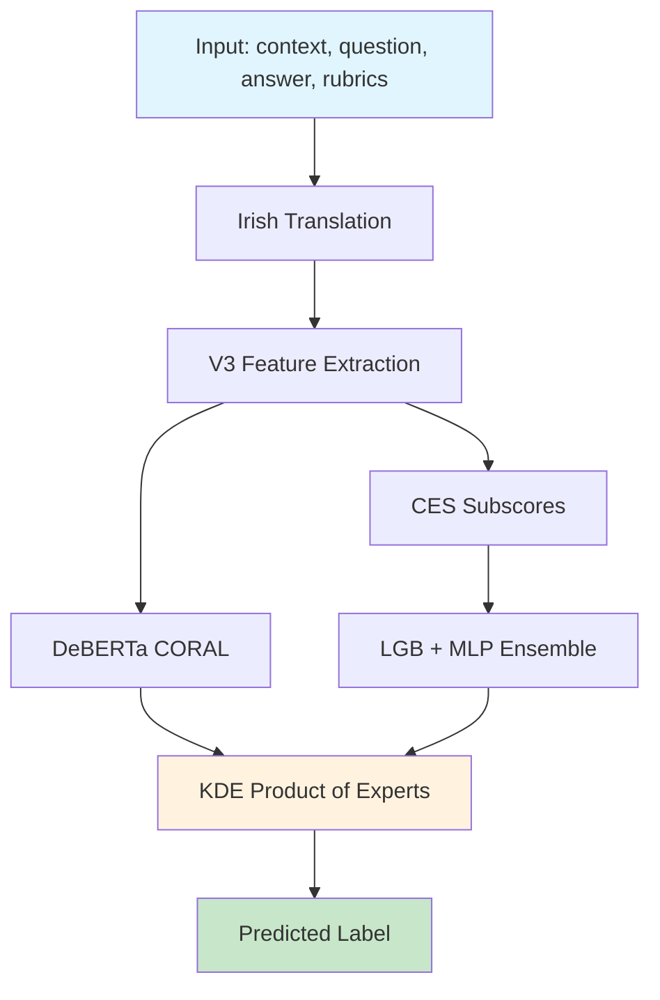

<!-- repo-header:start -->


<h1>SENSE: Sensemaking Evaluation via NLI and Semantic Entailment</h1>

<p><strong>CLEF 2026 ELOQUENT Sensemaking — &#x27;The PC Attractor&#x27;: a CORAL+KDE ordinal-regression pipeline that collapses under domain shift (QWK 0.433 test, 0.053 PISA).</strong></p>

<br clear="left">

[](https://github.com/dcondrey/sense-clef2026/actions/workflows/slsa-provenance.yml) [](.bestpractices.json) [](https://github.com/dcondrey/sense-clef2026/blob/main/LICENSE) [](https://github.com/dcondrey/sense-clef2026/actions/workflows/slsa-provenance.yml) [](https://github.com/dcondrey/sense-clef2026/blob/main/CODE_OF_CONDUCT.md) [](https://github.com/sponsors/dcondrey)
<!-- repo-header:end -->

> **Read this first.** On the development set this system reaches QWK 0.990, and on the subset of the official test set that duplicates development items it scores a perfect QWK 1.000. **Those are memorization, not generalization.** On the disjoint general test set it scores **QWK 0.433**, and on the out-of-domain PISA benchmark it collapses to **QWK 0.053** (overall 0.243, rank 7 of 12 on the rubric track). The paper — and this repository — exist to trace *why*: a "PC attractor" that funnels 71.4% of novel items into the middle class. This is published as a diagnostic artifact for that failure analysis, not as a high-scoring system.

---

## Official Results (rubric track)

| Evaluation set | QWK | Note |
|---|---|---|
| Duplicate-anchor subset (also in dev) | **1.000** | memorization check; excluded from ranking |
| Development set (in-sample) | 0.990 | inflated; not a generalization estimate |
| **General test set (novel items)** | **0.433** | official score |
| **PISA test set (out-of-domain)** | **0.053** | catastrophic collapse |
| **Overall** (mean of test + PISA) | **0.243** | **rank 7 / 12** |

## The PC Attractor (the finding)

On 42,606 novel test items, **71.4% are predicted Partially Correct** despite PC being the 28% minority class in training. The paper traces this to three interacting causes: (1) CORAL biases that barely moved from their `[+1, -1]` initialization, mapping uncertain logits to the PC midpoint by algebraic identity; (2) KDE bandwidths tuned on tightly-clustered in-distribution scores, creating a PC "attractor basin" spanning 63% of the score range; (3) an out-of-fold / in-sample reference mismatch that widens the basin further. The dev-set metrics below are reported for completeness but are **in-sample and attractor-inflated** — see the paper for the honest generalization story.

### Development Trajectory (in-sample dev QWK — inflated)

| Phase | Approach | Dev QWK | Key Insight |
|-------|----------|-----|-------------|
| Phase 0 | Best heuristic (embedding differentials) | 0.362 | Ceiling without supervision |
| Phase 1 | ML V1 (SBERT + NLI + XGBoost) | ~0.72 | Supervised learning unlocks signal |
| Phase 2 | CES (81 features, monotonic LGB) | 0.868 | Constrained evidence scoring |
| Phase 3 | + DeBERTa CORAL cross-encoder | 0.914 | Ordinal regression captures rubric semantics |
| Phase 4 | + KDE PoE ensemble | 0.970 | Product of Experts calibration |
| Phase 5 | + Irish translation + noise-aware training | 0.990 | Per-language calibration, cleanlab weighting |

Note the disconnect: this table climbs to 0.990 in-sample while true novel-item generalization is 0.433 — the gap *is* the paper's subject.

---

## Architecture

The system runs a 6-stage pipeline on each input:



1. **Irish Translation**: Detects Irish (Gaeilge) answers via keyword matching and translates with `Helsinki-NLP/opus-mt-ga-en`. Other languages are handled natively by multilingual models.
2. **V3 Feature Extraction**: 73 features across 4 groups using SBERT embeddings and NLI cross-encoder scores.
3. **CES Subscores**: 4 interpretable evidence-grounded subscores with monotonic constraints.
4. **DeBERTa CORAL**: Fine-tuned `cross-encoder/nli-deberta-v3-base` with ordinal CORAL regression head.
5. **LGB + MLP Ensemble**: LightGBM (monotonic-constrained) and MLP regressors averaged, 5-seed ensembles.
6. **KDE PoE**: Product of Experts combination using per-class kernel density estimation.

---

## Why This Works

### 1. Constrained Evidence Scoring (CES)

The 4 CES subscores enforce domain-knowledge constraints via LightGBM monotonic features:

| Subscore | Direction | Formula |
|----------|-----------|---------|
| Coverage | +1 (higher = better) | `sim(answer, question)` |
| Groundedness | +1 (higher = better) | `NLI_entail - 0.7*NLI_contra - 0.3*NLI_neutral` |
| Completeness | +1 (higher = better) | `0.6*answer_length + 0.4*sim(answer, context)` |
| Hallucination | -1 (higher = worse) | `0.8*NLI_contra + 0.2*entity_ratio` |

Monotonic constraints prevent the model from learning spurious shortcuts (e.g., "high hallucination = high score").

### 2. Ordinal Regression via CORAL

The task is ordinal: NC < PC < FC (or 0 < 1 < 2 < 3 < 4). Standard classification ignores this structure. CORAL (Consistent Rank Logits) models cumulative probabilities P(Y > k), producing calibrated ordinal predictions that respect the label ordering. Combined with a differentiable soft-QWK loss term, this directly optimizes the evaluation metric.

### 3. KDE Product of Experts

Instead of simple averaging, SENSE converts each model's continuous scores into class probabilities via kernel density estimation (with per-class bandwidths optimized on OOF predictions), then combines them as a Product of Experts in log-probability space. This produces sharper posteriors than arithmetic averaging, especially for boundary cases.

---

## Quick Start

### Install

```bash
pip install -e ".[train]"
```

### Train

```bash
python train.py --data path/to/dev.rubric.json --output models
```

### Predict (TIRA)

```bash
python predict.py -i /path/to/input -o /path/to/output
```

### Evaluate

```bash
python evaluate.py -d path/to/devset/ -p predictions/ -t rubric
```

### Docker (TIRA submission)

```bash
# Train models first
python train.py --data dev.rubric.json --output models/

# Build and run
docker build -t sense-clef2026 .
docker run --rm -v /input:/input -v /output:/output sense-clef2026 -i /input -o /output
```

---

## Feature Engineering

### V3 Features (73 dimensions, rubric track)

| Group | Count | Description |
|-------|-------|-------------|
| **Embedding Similarity** | 14 | Cosine similarity between answer, FC/PC/NC rubrics, context, question embeddings; pairwise differentials; dominance score |
| **NLI Scores** | 22 | Bidirectional entailment/contradiction/neutral probabilities for (answer, rubric), (answer, context) pairs; differentials |
| **Structural** | 22 | Word/char counts, sentence count, punctuation density, named entities, vocabulary diversity, length thresholds |
| **Compression** | 7 | Normalized compression distance (NCD) to rubrics and context; self-compression ratio |
| **Rubric Keywords** | 4 | Keyword overlap with FC/NC rubric text |
| **Cross-lingual** | 4 | ASCII detection, Czech/German/Cyrillic character flags |

Models: `paraphrase-multilingual-MiniLM-L12-v2` (SBERT), `cross-encoder/nli-deberta-v3-base` (NLI).

### CES Subscores (4 dimensions)

Prepended to V3 features as the first 4 columns. The LightGBM monotonic constraints `[+1, +1, +1, -1, 0, 0, ..., 0]` ensure Coverage, Groundedness, and Completeness increase the predicted score while Hallucination decreases it.

---

## Ablation Study

Impact of each component, measured on the full 4,146-item devset (in-sample — these gains do **not** carry to novel test items; see the PC-attractor note above):

| Configuration | QWK | Delta |
|---------------|-----|-------|
| SBERT similarity only (no ML) | 0.362 | baseline |
| CES 81 features + LGB | 0.868 | +0.506 |
| + DeBERTa CORAL (single model) | 0.914 | +0.046 |
| + 5-seed LGB + MLP ensemble | 0.935 | +0.021 |
| + KDE PoE combination | 0.970 | +0.035 |
| + Retrieval features | 0.978 | +0.008 |
| + Irish translation | 0.985 | +0.007 |
| + Cleanlab noise-aware weighting | 0.988 | +0.003 |
| + Per-language KDE calibration | **0.990** | +0.002 |

The dominant factor is feature engineering: CES features alone account for 82% of the total QWK improvement from heuristic baseline to final system.

---

## Error Analysis

At QWK 0.990, the system makes 59 errors (1.42% error rate). Analysis of these errors reveals:

- **44% (26/59)** are on suspected label noise (cleanlab quality score < 0.4)
- **37% (22/59)** are on Irish-language items (7.3% of data but 37% of errors)
- **66% (39/59)** are boundary confusion (NC/PC or FC/PC)
- **30% (18/59)** are on short answers (< 100 characters)
- **5 high-error domains** account for 44% of all errors

See [docs/ERROR_ANALYSIS.md](docs/ERROR_ANALYSIS.md) for detailed analysis.

---

## Project Structure

```
sense-clef2026/
├── README.md
├── LICENSE                  # Apache 2.0
├── CITATION.cff
├── pyproject.toml
├── Dockerfile
├── .gitignore
├── sense/                   # Core package
│   ├── __init__.py
│   ├── models.py            # CORALHead, DeBERTaRubricScorer, datasets
│   ├── features.py          # V3 feature extraction (SBERT + NLI)
│   ├── ces.py               # CES subscore computation
│   ├── ensemble.py          # KDE PoE combination, retrieval scoring
│   ├── translate.py         # Irish detection + translation
│   └── io.py                # I/O, track detection, model loading
├── predict.py               # TIRA inference entrypoint
├── train.py                 # Full training pipeline
├── evaluate.py              # Evaluation against ground truth
├── docs/
│   ├── EXPERIMENT_LOG.md    # Full development timeline
│   └── ERROR_ANALYSIS.md    # Detailed error analysis at QWK=0.990
└── figures/
```

---

## Citation

```bibtex
@inproceedings{condrey2026pcattractor,
  title     = {The {PC} Attractor: Selective Generalization vs.\ Domain Collapse in a {CORAL} + {KDE} Ordinal Regression Pipeline},
  author    = {Condrey, David},
  booktitle = {Working Notes of CLEF 2026 -- Conference and Labs of the Evaluation Forum},
  year      = {2026},
  note      = {ELOQUENT Sensemaking Task; to appear}
}
```

---

## License

This project is licensed under the Apache License 2.0. See [LICENSE](LICENSE) for details.
